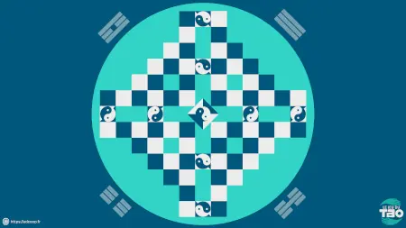

+++
author = "Alban Dericbourg"
title = "Plateau de Jeu du Tao"
date = "2025-06-09"
description = "Plateau numérique de Jeu du Tao pour des parties en ligne"
tags = ["Ressource", "Jeu du Tao"]
+++

Lors d'une partie en présentiel, l'animateurice apporte son plateau de jeu. Et lors
d'une partie à distance ?

Parce que tou·te·s les joueureuses n'ont pas à leur disposition un plateau, je
trouve utile d'en partager un pour avoir un support visuel. Lire à vous ensuite
d'y déplacer les pierres de votre choix : des pastilles de couleur, la photo des
participant·e·s...

***

[Télécharger le plateau numérique](JeuDuTao_Plateau.zip)

> Cette archive contient :
> * Un plateau haute définition au format PNG
> * Un plateau vectoriel au format SVG

***